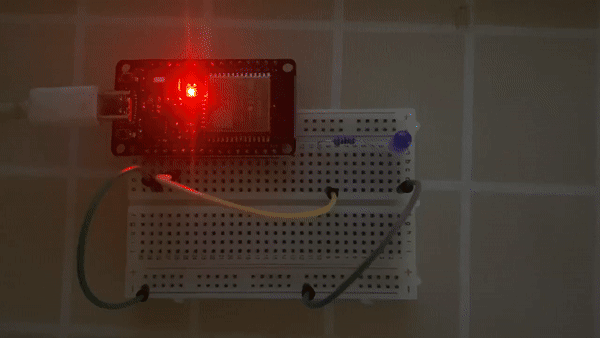
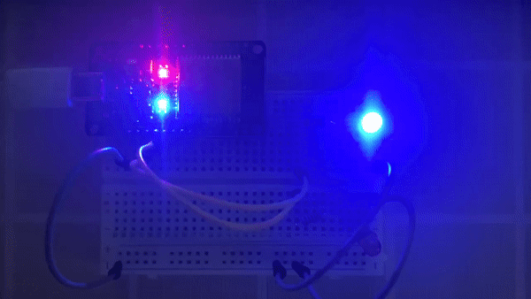

## Personal ESP32 Projects

## Build & Flash with ESP-IDF

1. `cd` into project directory
```sh
cd blink-led
```

2. Build project: 
```sh
idf.py build
```

3. Connect ESP32 via USB

4. Flash binary onto ESP32
```sh
idf.py -p /dev/ttyUSB0 flash
```

## 1. Blink LED



## 2. Blink Multiple LEDs


